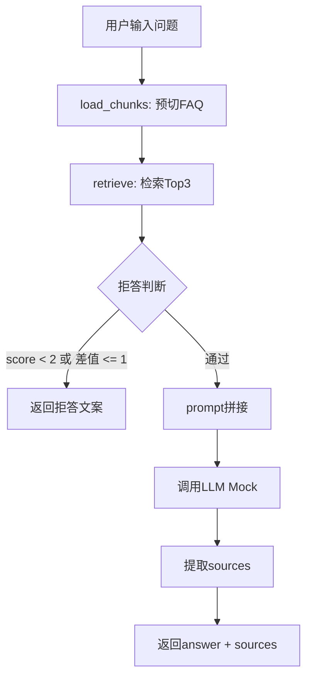

# RAG 课程助手 — 设计文档

## 1. 数据流图



**文字说明**：
1. 程序启动时，`load_chunks()` 读取 `course-faq.md`，按 `## [faq-XX]` 正则切分，存入内存列表
2. 用户输入问题后，调用 `retrieve()` 对问题进行短语切分、停用词过滤、布尔命中计分，返回 Top3 结果
3. 调用 `answer()` 进行拒答判断：若 Top1 分数 < 2 或 Top1-Top2 分数差 <= 1，直接返回拒答文案
4. 若通过阈值，拼接 System Prompt + 【参考资料1/2/3】+ User Prompt，调用 LLM Mock 生成回答
5. 从 retrieve 返回的 Top3 结果中提取 id 列表作为 sources，与 LLM 回答一起返回

## 2. 模块接口

### 2.1 调用链

```
main.py
  └── answer.py
        └── retrieve.py
```

- `main.py`：CLI 入口，解析命令行参数，调用 `answer()`，格式化输出
- `answer.py`：回答模块，调用 `retrieve()` 获取 Top3，判断拒答，拼接 Prompt，调用 LLM
- `retrieve.py`：检索模块，实现短语切分、停用词过滤、布尔命中计分、排序

### 2.2 load_chunks() 模块

**职责**：程序启动时预切 FAQ 文件，存入内存列表

**算法步骤**：
```
load_chunks(filepath):
    1. 读取 course-faq.md 文件内容
    2. 用正则 \n(?=##\s*\[faq-\d{2}\]) 分割文本
    3. 去除空白，得到 10 个独立 chunk
    4. 返回 chunks 列表
```

**触发时机**：main.py 启动时调用一次，后续查询直接读内存

### 2.3 retrieve() 模块

**职责**：检索与用户问题最相关的 Top3 FAQ 条目

**接口签名**：
```python
def retrieve(question: str, chunks: list) -> list
```

**算法步骤**：
```
retrieve(question, chunks):
    1. 预处理问题：
       a. 按标点（逗号、句号、空格、问号、感叹号）切分为短语列表
       b. 剔除长度 <= 1 的字符
       c. 剔除停用词：的、了、吗、呢、要、么、什、我、你、是、在、有、和、与
       d. 得到有效关键词列表 K
    
    2. 布尔命中计分：
       对于每个 chunk c:
         score = 0
         matched_keywords = []
         对于 K 中每个关键词 k:
           如果 k 出现在 c 中 且 k 不在 matched_keywords 中:
             score += 1
             matched_keywords.append(k)
         记录 chunk 的 id、content、score
    
    3. 排序：
       按 score 降序排列
       取前 3 个 score > 0 的结果返回
       若无 score > 0 的结果，返回空列表 []
```

**输出格式**：
```python
[
    {"id": "faq-01", "content": "chunk内容", "score": 3},
    {"id": "faq-02", "content": "chunk内容", "score": 2},
    {"id": "faq-03", "content": "chunk内容", "score": 1}
]
```

### 2.4 answer() 模块

**职责**：调用 retrieve，判断拒答，拼接 Prompt，调用 LLM，返回最终结果

**接口签名**：
```python
def answer(question: str, chunks: list) -> dict
```

**算法步骤**：
```
answer(question, chunks):
    1. 调用 retrieve(question, chunks) 获取 top_results
    
    2. 拒答判断：
       如果 top_results 为空:
         返回 {"answer": "抱歉，知识库中没有与您问题匹配的相关信息。", "sources": []}
       如果 top_results[0]["score"] < MIN_HIT_COUNT (2):
         返回 {"answer": "抱歉，知识库中没有与您问题匹配的相关信息。", "sources": []}
       如果 len(top_results) > 1 且 top_results[0]["score"] - top_results[1]["score"] <= MIN_SCORE_GAP (1):
         返回 {"answer": "抱歉，未找到唯一匹配的资料，请确认您的问题是否清晰。", "sources": []}
    
    3. 拼接 Prompt：
       system_prompt = 见 3.1 节
       user_prompt = 见 3.2 节（嵌入 top_results 内容）
    
    4. 调用 LLM Mock：
       POST http://localhost:9876/v1/chat/completions
       请求体: {"model": "mock", "messages": [{"role": "system", "content": system_prompt}, {"role": "user", "content": user_prompt}]}
       获取 LLM 返回的纯文本答案
    
    5. 提取 sources：
       sources = [r["id"] for r in top_results]
    
    6. 返回结果：
       {"answer": llm_answer, "sources": sources}
```

**输出格式**：
```python
{
    "answer": "LLM生成的回答，或拒答文案",
    "sources": ["faq-01", "faq-02"]
}
```

### 2.5 main.py 模块

**职责**：CLI 入口，解析参数，调用 answer，格式化输出

**算法步骤**：
```
main():
    1. 解析命令行参数 sys.argv[1] 获取用户问题
    2. 若问题为空，打印"请输入您的问题"并退出
    3. 调用 load_chunks("data/course-faq.md") 获取 chunks 列表
    4. 调用 answer(question, chunks) 获取结果
    5. 打印 result["answer"]
    6. 若 result["sources"] 非空，打印"来源: faq-XX, faq-XX"
```

## 3. Prompt 模板

### 3.1 System Prompt

```
你是一个严格基于给定资料回答问题的助手。
你的任务：
1. 只根据下方【参考资料】中的内容回答用户问题。
2. 如果【参考资料】中没有明确提及答案，请直接回复"抱歉，根据现有资料无法回答该问题"，严禁编造或使用外部知识。
3. 回答时请用流畅的中文，保持简洁。
```

### 3.2 User Prompt

```
【参考资料 1】
[faq-01] 可复核交付是指助教不需要看代码，只看提交的证据文件就能独立判断。

【参考资料 2】
[faq-02] Day1最终提交包必须包含6类标准文件：spec.md、design.md、ai-log.md、test-record.md、README.md、reflection.md。

【参考资料 3】
[faq-03] ai-log的五字段：目的、输入、建议、人工判断、验证。

---
请根据以上参考资料回答用户问题：Day1要交什么？
```

## 4. 拒答规则

| 条件 | 结果 | 文案 |
|------|------|------|
| top_results 为空 | 资料外拒答 | "抱歉，知识库中没有与您问题匹配的相关信息。" |
| top_results[0]["score"] < 2 | 资料外拒答 | "抱歉，知识库中没有与您问题匹配的相关信息。" |
| top_results[0]["score"] - top_results[1]["score"] <= 1 | 模糊拒答 | "抱歉，未找到唯一匹配的资料，请确认您的问题是否清晰。" |

## 5. 来源引用

**方案**：后处理拼接（方案 B）

**实现**：
1. `retrieve()` 返回 Top3 结果，每个结果包含 `id` 字段（如 `"faq-01"`）
2. `answer()` 从 Top3 结果中提取 id 列表：`sources = [r["id"] for r in top_results]`
3. LLM 只负责生成纯文本答案，不包含来源信息
4. 最终输出时，将 sources 列表与 LLM 回答一起返回

**示例输出**：
```
根据资料，Day1需要提交6类标准文件：spec.md、design.md、ai-log.md、test-record.md、README.md、reflection.md。

来源: faq-02
```

## 6. 配置常量

| 常量名 | 值 | 说明 |
|-------|---|------|
| `MIN_HIT_COUNT` | 2 | 必须命中至少 2 个不同有效关键词，否则拒答 |
| `MIN_SCORE_GAP` | 1 | Top1 - Top2 <= 1 时拒答 |
| `LLM_API_BASE` | `http://localhost:9876/v1` | LLM Mock 服务地址 |
| `LLM_MODEL` | `mock` | 模型名称 |

## 7. 文件结构

```
rag-assistant/
├── data/
│   └── course-faq.md          # 知识库（10条FAQ）
├── docs/
│   ├── spec.md                # 规格说明
│   ├── design.md              # 设计文档（本文件）
│   └── ai-log.md              # AI协作日志
├── llm-mock/
│   ├── mock_server.py         # LLM Mock服务
│   └── README.md              # Mock使用说明
├── src/
│   ├── retrieve.py            # 检索模块
│   ├── answer.py              # 回答模块
│   └── main.py                # CLI入口
├── tests/
│   ├── test_basic.py          # 基础测试
│   └── questions.json         # 测试问题
├── .gitignore                 # Git忽略文件
└── README.md                  # 项目说明
```
